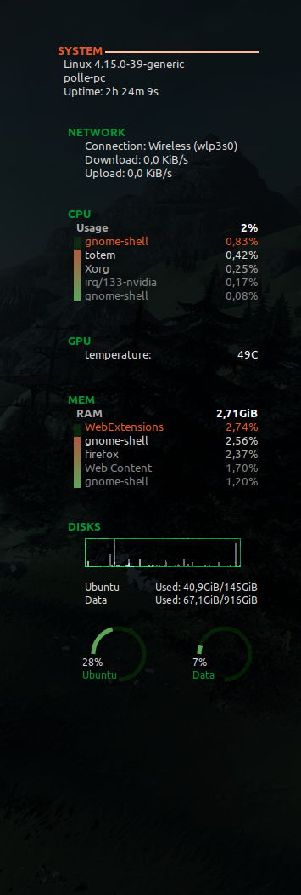

# conky_special_bars
This is an easily configurable lua script for adding special bars to your conky configuration. This is an adaptation of an original lua script by despot77. I updated the script to allow for vertical status bars and I added an easy way to add color gradients to those bars.

The script for drawing these bars is `special_bars.lua`. Feel free to reuse and update it for your personal needs.

In this repository I have also placed another script I found that properly draws a transparent background (`draw_bg.lua`) as well as my own `.conkyrc` configuration. 

The combination of these should present you with a working configuration as shown below that you can modify to suit your personal needs.

*Note that I have briefly manipulated the CPU and MEM utilization to properly showcase the colour gradients of the vertical bars in the screenshot.*
